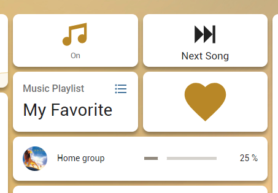
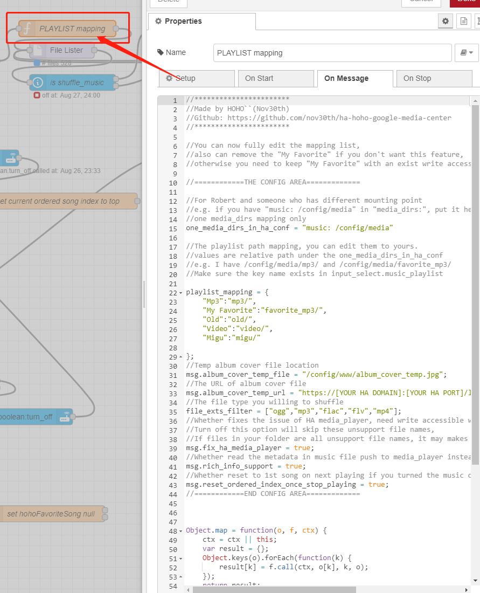
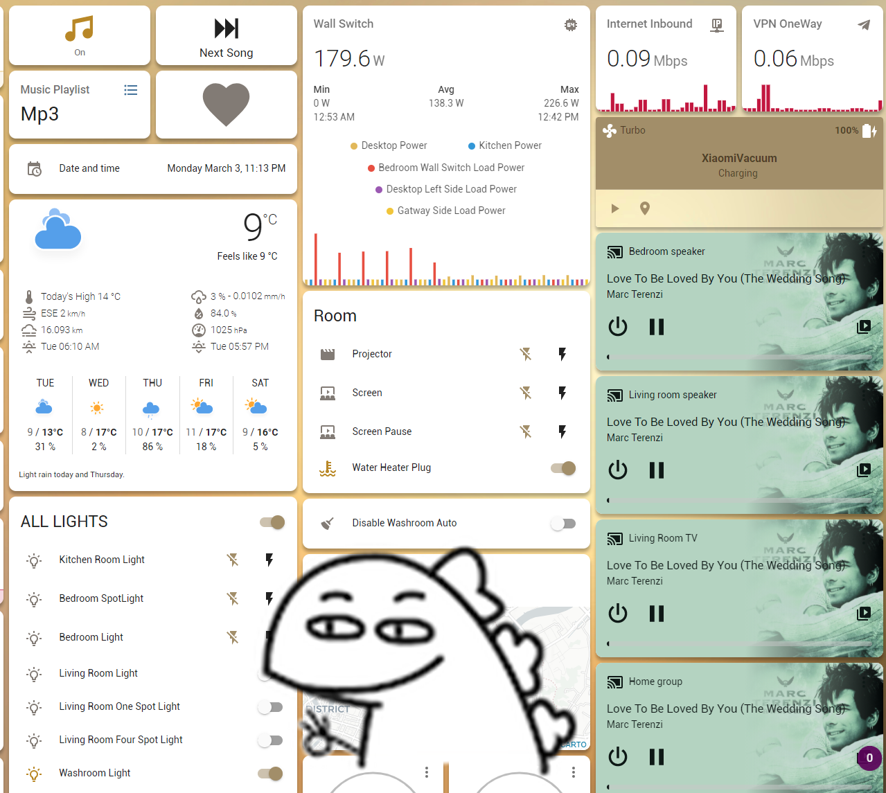

# ha-hoho-google-media-centre
Homeassistant Google Home/Nest/TV music centre

## Summary
上周买了两个Google Nest Mini 与 Chromecast，在此之前，从来没发现Google设备如此方便，可以在多个音箱上同时播放音乐，能让家里无死角充满温馨的音乐。于是在我自己的HA系统里寻找是否有现成简单的组件来进行随机播放音乐，以及音乐列表功能。
结果发现多是YouTube与Spotify在线播放，在国内这非常不方便，VPN基本都有总流量，用本地音乐更合适，于是 [HA国外讨论区](https://community.home-assistant.io/t/m3u-playlists-in-media-browser/243231/31)找了和提问都没有发现现成的，那么，随手做一个吧。

Homemade music centre via Chromecast with node-red in Homeassistant.

**Simply And Easy.**

## Features

- Shuffling music / Stop playing to Google Home / Nest by toggle the music_time button.
- Shuffling music / Stop playing by telling Google Home / Nest to turn on/off "Music Time" (google_assistant linked with HA required).
- Stop the music playing (e.g "Hey Google, Stop") to media_player will stop shuffling music automatically.
- Play the next song by simply calling service media_player.media_stop.
- Music can be played with different playlists.
- Favorite songs can be added or delete by press the Favorite button.
- Added favorite button that can make it look likes a rich functional media player.
- Supports ID3 of mp3 file to media player displaying.
- Media player has a background if the media file contains an image.
- Local media playing will stop automatically if you have voice-controlled like News or play online music.

## Before Setup

1. You need to have node-red installed in your HA.
2. Set your media folder as following or customized and configure it in node-red later.
```
homeassistant:
  media_dirs:
    music: /config/media
```

Your local folder should looks like this:
```
| config/
| -- media/
| -- | mp3/
| -- | -- | a.mp3
| -- | -- | d.ogg
| -- | -- | sub-folder/
| -- | -- | -- |oh-yes.mp3
| -- | -- | -- |oh-no.mp3
| -- | favorite_mp3/
| -- | -- | b.mp3
| -- | -- | c.mp3
```
> I mounted the folder (/config/media) [rw] from my SMB server, as you could easily create this folder if disk space is not a problem.

## Setup

1. Create the below input entity in your HA -> Configuration -> Helpers.

    Name|Entity ID|Type|Options
    ---|---|---|---
    Favorite Song|input_boolean.favorite_song|Toggle
    Music Playlist|input_select.music_playlist|Dropdown|Mp3;My Favorite(2 items)
    Music Time|input_boolean.music_time|Toggle

2. Install node-red palettes

    Name|Version
    ---|---
    node-red-contrib-fs|1.4.1 or above
    node-red-contrib-media-tags|0.0.6 or above
    node-red-contrib-fs-ops|1.6.0 or above


3. Parse the node-red flow to your HA node-red.

    >[Node-Red Code](node-red_main.txt)

    >[Node-Red Fav Button Control Part](node-red_fav_btn.txt)


4. Add buttons to your Lovelace page.

    

    > Next Song Button:
    ```
    type: 'custom:button-card'
    tap_action:
    action: call-service
    service: media_player.media_stop
    service_data:
        entity_id: media_player.home_group
    size: 50px
    icon: 'hass:skip-forward'
    name: Next Song
    ```

    > Volume Control
    ```
    type: entities
    entities:
    - type: 'custom:slider-entity-row'
        entity: media_player.home_group
    ```

## Configuration

1. Edit the "PLAYLIST mapping" in node-red.

    

    Var|Meaning
    ---|---
    one_media_dirs_in_ha_conf|For Robert and someone who has different mounting point in media_dirs
    playlist_mapping|Mapping the input_select.music_playlist items to your local folder
    msg.album_cover_temp_file|Music album cover image tempuary file
    msg.album_cover_temp_url|The URL of album_cover_temp_file, DOMAIN could be ip address.
    file_exts_filter|file types
    msg.fix_ha_media_player|Whether fixes the issue of HA media_player
    msg.rich_info_support|Whether read the metadata in music file push to media_player instead of filenames.

## Enjoy the powerful node-red and this content.





## Give a star to this repo if you like it.