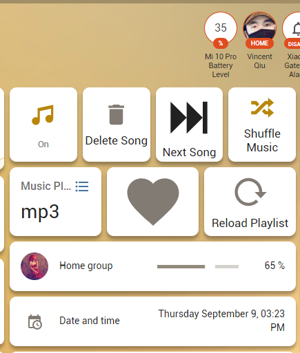

# ha-hoho-google-media-centre
Homeassistant Google Home/Nest/TV music centre

## Summary
上周买了两个Google Nest Mini 与 Chromecast，在此之前，从来没发现Google设备如此方便，可以在多个音箱上同时播放音乐，能让家里无死角充满温馨的音乐。于是在我自己的HA系统里寻找是否有现成简单的组件来进行随机播放音乐，以及音乐列表功能。
结果发现多是YouTube与Spotify在线播放，在国内这非常不方便，VPN基本都有总流量，用本地音乐更合适，于是 [HA国外讨论区](https://community.home-assistant.io/t/m3u-playlists-in-media-browser/243231/31)找了和提问都没有发现现成的，那么，随手做一个吧。

Homemade music centre via Chromecast with node-red in Homeassistant.

**Simply And Easy.**

## Features

- Ordered playing / Shuffling music / Stop playing to Google Home / Nest by toggle the music_time button.
- Ordered playing / Shuffling music / Stop playing by telling Google Home / Nest to turn on/off "Music Time" (google_assistant linked with HA required).
- Stop the music playing (e.g "Hey Google, Stop") to media_player will stop shuffling music automatically.
- Loads the music folder into playlist automatically.
- Play the next song by simply calling service media_player.media_stop.
- Music can be played with different playlists.
- Favorite songs can be added or delete by press the Favorite button.
- Added favorite button that can make it look likes a rich functional media player.
- Supports ID3 of mp3 file to media player displaying.
- Media player has a background if the media file contains an image.
- Local media playing will stop automatically if you have voice-controlled like News or play online music.

## Before Setup

1. You need to have node-red installed in your HA.
2. Set your media folder as following or customized and configure it in node-red later.
```
homeassistant:
  media_dirs:
    music: /config/media
```

Your local folder should looks like this:
```
| config/
| -- media/
| -- | mp3/
| -- | -- | a.mp3
| -- | -- | d.ogg
| -- | -- | sub-folder/
| -- | -- | -- |oh-yes.mp3
| -- | -- | -- |oh-no.mp3
| -- | favorite_mp3/
| -- | -- | b.mp3
| -- | -- | c.mp3
```
> I mounted the folder (/config/media) [rw] from my SMB server, as you could easily create this folder if disk space is not a problem.

> By default, please have mp3 and favorite_mp3 two folders created.

## Setup

1. Put/Merge the input sections into your configurations

```yaml
input_boolean:
  favorite_song:
    name: Favorite Song
    icon: mdi:heart
  music_time:
    name: Music Time
    icon: mdi:music
  delete_song:
    name: Delete Song
    icon: mdi:delete
  shuffle_music:
    name: Shuffle Music
    icon: mdi:shuffle-variant
  reload_playlist:
    name: Reload Playlist
    icon: mdi:reload
input_select:
  music_playlist:
    name: Music Playlist
    options:
      - Mp3
      - My Favorite
```
> Looks like as below:


Name|Entity ID|Type|Options|Icon
---|---|---|---|---
Favorite Song|input_boolean.favorite_song|Toggle||hass:heart
Music Playlist|input_select.music_playlist|Dropdown|Mp3;My Favorite(2 items)
Music Time|input_boolean.music_time|Toggle||hass:music
Delete Song|input_boolean.delete_song|Toggle||hass:delete
Shuffle Music|input_boolean.shuffle_music|Toggle||mdi:shuffle-variant
Reload Playlist|input_boolean.reload_playlist|Toggle||mdi:reload

2. Install node-red palettes

    Name|Version
    ---|---
    node-red-contrib-fs| 1.4.1 pass
    node-red-contrib-media-tags| 0.0.6 pass
    node-red-contrib-fs-ops| 1.6.0 pass
    node-red-contrib-random-item| 1.0.3 pass


3. Parse the node-red flow to your HA node-red.

    >[Node-Red Code](node-red_main.txt)

4. Add buttons to your Lovelace page.

    

    > Next Song Button:
    ```
    type: 'custom:button-card'
    tap_action:
    action: call-service
    service: media_player.media_stop
    service_data:
        entity_id: media_player.home_group
    size: 50px
    icon: 'hass:skip-forward'
    name: Next Song
    ```

    > Volume Control
    ```
    type: entities
    entities:
    - type: 'custom:slider-entity-row'
        entity: media_player.home_group
    ```

## Configuration

1. Edit the "PLAYLIST mapping" in node-red.

    

    Var|Meaning
    ---|---
    one_media_dirs_in_ha_conf|For Robert and someone who has different mounting point in media_dirs
    playlist_mapping|Mapping the input_select.music_playlist items to your local folder, you could ignore this after v5 version and use the "reload playlist" button.
    msg.album_cover_temp_file|Music album cover image tempuary file
    msg.album_cover_temp_url|The URL of album_cover_temp_file, DOMAIN could be ip address.
    file_exts_filter|file types
    msg.fix_ha_media_player|Whether fixes the issue of HA media_player
    msg.rich_info_support|Whether read the metadata in music file push to media_player instead of filenames.
    msg.reset_ordered_index_once_stop_playing|Whether reset to 1st song on next playing if you turned the music off (non-shuffle mode)

## Enjoy the powerful node-red and this content.


## Give a star to this repo if you like it.

## Troubleshooting

1. Make sure you have all buttons on your localace.
2. Clicks the "Reload Playlist" button will have your "Music Playlist" drop down list filled with all subfolders.
3. Attachs "Debug" node and changes the "Debug" node output to "complete msg object" to see the details in right side bar of any node that might have problem (in node-red), by doing this you might need to a bit familar with node-red.
